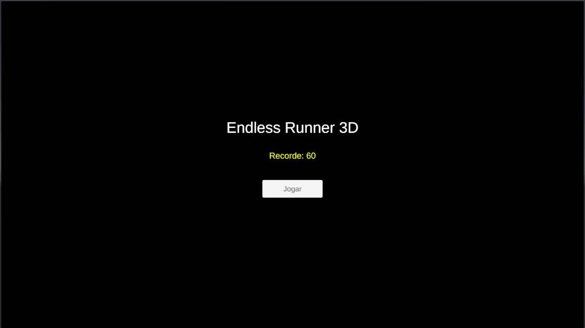
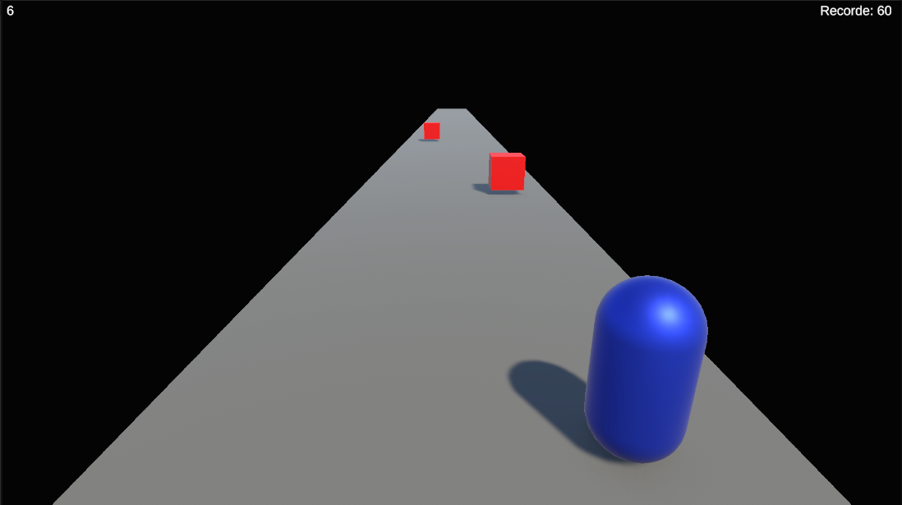
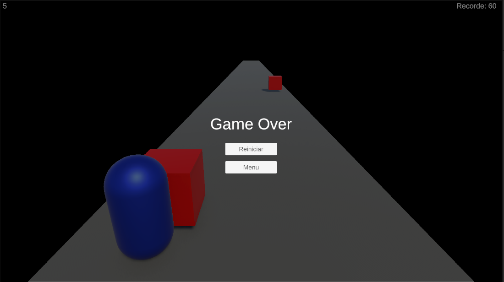
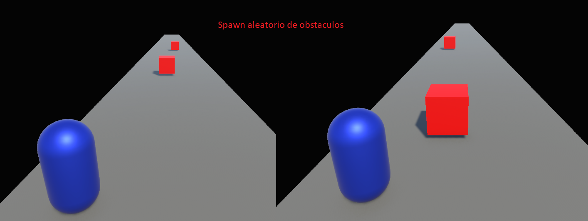
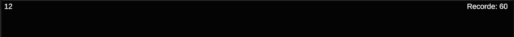

# 🏃 Endless Runner 3D

> Jogo de corrida infinita em 3D desenvolvido com Unity 6. Desvie de obstáculos, sobreviva o máximo possível e bata seu próprio recorde enquanto a velocidade aumenta progressivamente.

---

## 👤 Autor

**Thales** — Engenharia de Software, Uni-FACEF

---

## 🎮 Descrição

Endless Runner 3D é um jogo de corrida infinita onde o jogador controla um personagem que corre automaticamente por uma pista sem fim. Obstáculos vermelhos aparecem aleatoriamente na pista e o jogador deve desviar saltando ou se movendo lateralmente. A velocidade aumenta conforme o score sobe, tornando o jogo progressivamente mais difícil.

O jogo foi desenvolvido inteiramente com primitivos do Unity (cubos e cápsulas), sem nenhum asset externo, usando **Unity 6.3 LTS** e o novo **Input System**.

---

## 🕹️ Como jogar

| Tecla | Ação |
|-------|------|
| `A` / `←` | Mover para a esquerda |
| `D` / `→` | Mover para a direita |
| `Space` | Pular |

**Objetivo:** Sobreviva o máximo de tempo possível desviando dos obstáculos vermelhos. Seu score aumenta com o tempo e é salvo automaticamente como recorde entre sessões.

---

## 📸 Screenshots

### Menu Principal


### Gameplay


### Game Over


---

## 🎬 Gameplay

[](https://www.youtube.com/watch?v=o1VexmAh-eU)

---

## ⚙️ Funcionalidades desenvolvidas

### Funcionalidade 1 — Geração procedural de obstáculos

Foi desenvolvido um sistema de spawn procedural que gera obstáculos em posições aleatórias na pista enquanto o jogo roda. Os obstáculos se movem em direção ao jogador e são destruídos automaticamente quando saem do campo de visão, evitando acúmulo de objetos na memória.

**Como funciona:**
- Uma `Coroutine` em loop executa o spawn a cada intervalo de tempo
- `Random.Range` sorteia a posição X do obstáculo dentro da largura da pista
- O obstáculo é instanciado como `Prefab` à frente do jogador e se move via `translate`
- Quando o obstáculo passa da posição Z `-10`, é destruído automaticamente com `Destroy`
- O intervalo entre spawns diminui conforme o score aumenta, com mínimo de `0.5s`

```csharp
using UnityEngine;
using System.Collections;

public class SpawnObstaculos : MonoBehaviour
{
    public GameObject prefabObstaculo;
    public float distanciaSpawn = 25f;
    public float larguraPista = 2f;

    private float intervaloSpawn = 2f;

    void Start()
    {
        StartCoroutine(LoopSpawn());
    }

    IEnumerator LoopSpawn()
    {
        while (true)
        {
            if (GameManager.jogoAtivo)
            {
                SpawnarObstaculo();
                intervaloSpawn = Mathf.Max(0.5f, 2f - (GameManager.score / 50f));
            }
            yield return new WaitForSeconds(intervaloSpawn);
        }
    }

    void SpawnarObstaculo()
    {
        float posX = Random.Range(-larguraPista, larguraPista);
        Vector3 posicao = new Vector3(posX, 0.75f, distanciaSpawn);
        GameObject obs = Instantiate(prefabObstaculo, posicao, Quaternion.identity);

        MovimentoObstaculo mov = obs.GetComponent<MovimentoObstaculo>();
        if (mov != null)
            mov.velocidade = GameManager.velocidadeAtual;
    }
}
```

**Print da funcionalidade em jogo:**



---

### Funcionalidade 2 — Velocidade progressiva com sistema de score e highscore

Foi desenvolvido um sistema de score baseado em tempo onde a dificuldade aumenta automaticamente conforme o jogador avança. O score é exibido em tempo real no HUD via TextMeshPro, a velocidade dos obstáculos sobe proporcionalmente e o highscore é salvo com `PlayerPrefs` para persistir entre sessões.

**Como funciona:**
- `score` aumenta continuamente com `Time.deltaTime` enquanto `jogoAtivo` for `true`
- A velocidade é calculada dinamicamente: `velocidadeBase + (score / 10f * 0.5f)`
- Cada obstáculo instanciado recebe a velocidade atual no momento do spawn
- Ao colidir com obstáculo, o `GameOver()` é chamado, o painel aparece e o score é comparado ao `PlayerPrefs`
- O highscore persiste entre sessões e é exibido no menu e na tela de game over

```csharp
using UnityEngine;
using UnityEngine.SceneManagement;
using TMPro;

public class GameManager : MonoBehaviour
{
    public static GameManager instancia;
    public static bool jogoAtivo = false;
    public static float score = 0f;
    public static float velocidadeAtual = 8f;

    public TextMeshProUGUI textoScore;
    public TextMeshProUGUI textoHighscore;
    public GameObject painelGameOver;
    public float velocidadeBase = 8f;

    void Awake()
    {
        instancia = this;
    }

    void Start()
    {
        score = 0f;
        jogoAtivo = true;
        velocidadeAtual = velocidadeBase;
        painelGameOver.SetActive(false);

        int highscore = PlayerPrefs.GetInt("highscore", 0);
        textoHighscore.text = "Recorde: " + highscore;
    }

    void Update()
    {
        if (!jogoAtivo) return;

        score += Time.deltaTime;
        velocidadeAtual = velocidadeBase + (score / 10f * 0.5f);

        if (textoScore != null)
            textoScore.text = "Score: " + Mathf.FloorToInt(score);
    }

    public void GameOver()
    {
        jogoAtivo = false;
        painelGameOver.SetActive(true);

        int scoreAtual = Mathf.FloorToInt(score);
        int highscore = PlayerPrefs.GetInt("highscore", 0);

        if (scoreAtual > highscore)
        {
            PlayerPrefs.SetInt("highscore", scoreAtual);
            textoHighscore.text = "Novo recorde: " + scoreAtual;
        }
        else
        {
            textoHighscore.text = "Recorde: " + highscore;
        }
    }

    public void Reiniciar()
    {
        SceneManager.LoadScene(SceneManager.GetActiveScene().buildIndex);
    }

    public void IrParaMenu()
    {
        SceneManager.LoadScene("Menu");
    }
}
```

**Print da funcionalidade em jogo:**



---

## 🗂️ Estrutura do projeto

```
Assets/
├── Scenes/
│   ├── Menu.unity
│   └── Jogo.unity
├── Scripts/
│   ├── ControleJogador.cs
│   ├── SpawnObstaculos.cs
│   ├── MovimentoObstaculo.cs
│   ├── PistaInfinita.cs
│   ├── GameManager.cs
│   └── MenuManager.cs
├── Prefabs/
│   ├── Obstaculo.prefab
│   └── ChunkPista.prefab
├── Materials/
│   ├── MatJogador.mat
│   ├── MatPista.mat
│   └── MatObstaculo.mat
└── Audio/
    └── musica_menu.mp3
```

---

## 🛠️ Como executar

1. Clone o repositório
2. Abra o projeto no **Unity 6.3 LTS** ou superior
3. Abra a cena `Menu.unity` em `Assets/Scenes/`
4. Pressione **Play** no Unity Editor

> Nenhum asset externo é necessário. O projeto usa apenas primitivos nativos do Unity.

---

## 🔧 Tecnologias

- **Unity 6.3 LTS** (6000.3.11f1)
- **C#**
- **Unity Input System** (novo sistema de input)
- **TextMeshPro** para HUD
- **PlayerPrefs** para persistência do highscore
